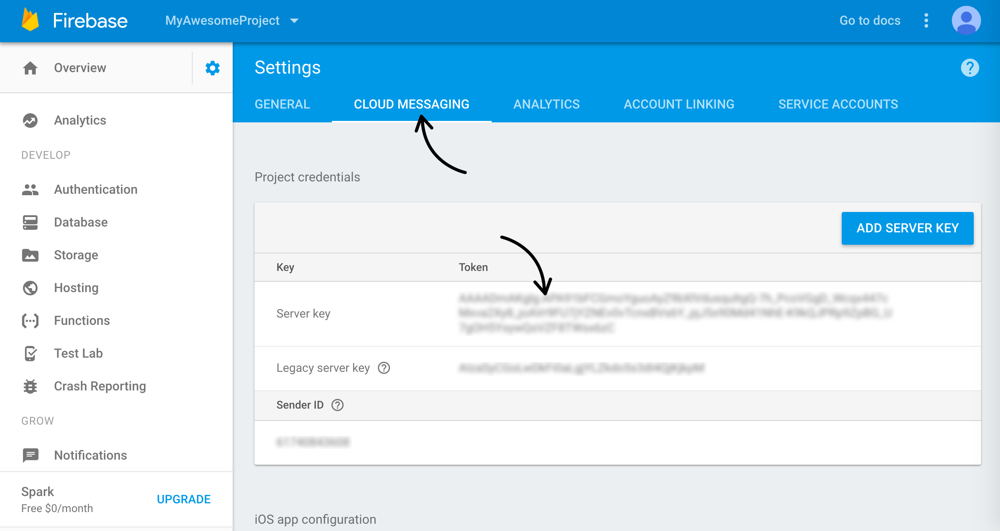

# Enable triggers

Based on what recipe triggers you want to use, some setup is necessary.

## Location Based Triggers

When you want to start the radar for geofences and beacons call this method:

```java
// call this when you are given the proper permission for scanning (ACCESS_FINE_LOCATION)
nearItManager.startRadar()
// to stop the radar call the method nearItManager.stopRadar()
```

The SDK automatically includes the permission for location access in its manifest (necessary for beacon and geofence monitoring). When targeting API level 23+, please ask for and verify the presence of ACCESS_FINE_LOCATION permissions at runtime.

## Push Triggers

To enable push recipes to reach the user, set up a firebase project and follow the official instructions to integrate it into an app. [If you need help follow those steps.](firebase.md)
Enter the cloud messaging firebase server key into the appropriate NearIT CMS section (see the screenshot and make sure to use the right api key).

Don't follow FCM-specific integration guides, we already deal with everything inside the SDK code. That means, you should not put any special FCM-related receiver or intent service in you app.

## Enable Background Notification

To enable our built-in background system notifications for both location and push triggers, add this in your app manifest application element.
```xml
<!-- built in background receiver -->
<receiver
    android:name="it.near.sdk.recipes.background.NearItBroadcastReceiver"
    android:exported="false">
    <intent-filter>
        <action android:name="it.near.sdk.permission.GEO_MESSAGE" />
        <category android:name="android.intent.category.DEFAULT" />
    </intent-filter>
    <intent-filter>
        <action android:name="it.near.sdk.permission.PUSH_MESSAGE" />
        <category android:name="android.intent.category.DEFAULT" />
    </intent-filter>
</receiver>
```
To learn how to deal with in-app content once the user taps on the notification, see this [section](handle-content.md).
You can use your own receiver for custom notification handling. See this [section](custom-bkg-notification.md).

You can set your own icon for the location-based notifications with the method *setNotificationImage(int imgRes)* of *NearItManager*

WARNING: If you are using some gms play services in your app and experience runtime malfunctioning, please be sure to use the 10.2.0 version of the gms dependency you are pulling in your app. Conflicting play services version may result in compile-time and run-time errors.
